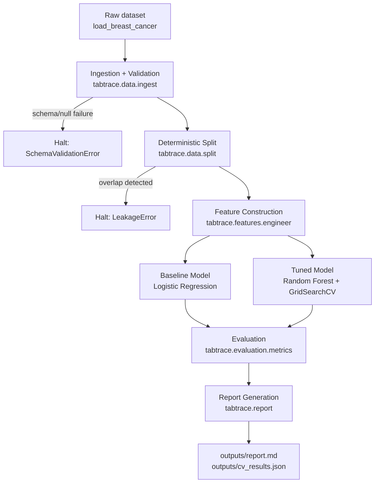

# Architecture

## Overview

TabTrace is a linear, checkpointed pipeline. Each stage is a pure, independently testable module under
`src/tabtrace/`; nothing lives only in a notebook. The pipeline halts and raises on the first failed invariant
(schema violation, split leakage, an unjustified feature) instead of silently continuing.

## Data & Control Flow

## Module Map

| Module                        | Responsibility                                                                               |
|-------------------------------|----------------------------------------------------------------------------------------------|
| `tabtrace.data.ingest`        | Loads the raw dataset; validates schema, nulls, dtypes, label domain.                        |
| `tabtrace.data.split`         | Computes/loads a deterministic, seeded, stratified train/val/test split; asserts no overlap. |
| `tabtrace.features.engineer`  | A registry of engineered features, each requiring a non-empty justification string.          |
| `tabtrace.models.baseline`    | Fast Logistic Regression baseline, establishing the floor.                                   |
| `tabtrace.models.tuned`       | Random Forest tuned via `GridSearchCV` under stratified k-fold CV.                           |
| `tabtrace.evaluation.metrics` | Cross-validated scoring (primary) plus held-out test metrics (secondary check).              |
| `tabtrace.report`             | Renders the metrics table + feature rationale into `outputs/report.md`.                      |
| `tabtrace.pipeline`           | Orchestrates the above stages in order; the single entry point (`run_pipeline()`).           |

## Why This Shape

The stage boundaries mirror the System Invariants in the project spec directly: split logic is isolated so it can be
tested for determinism and leakage in isolation; feature logic is isolated so every feature can be tested and its
justification enforced at registration time; evaluation is isolated so cross-validation is always the primary
reported number, with the held-out test set kept clearly secondary.
